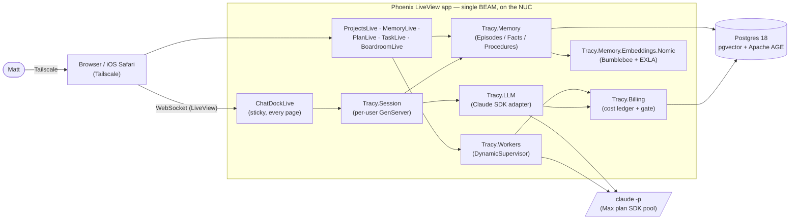
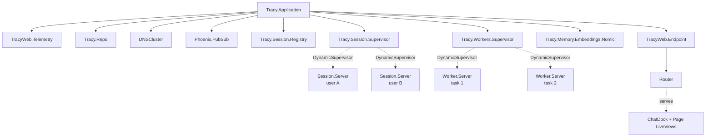
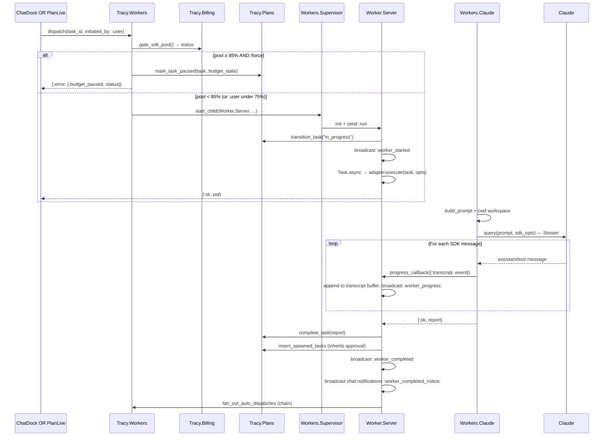
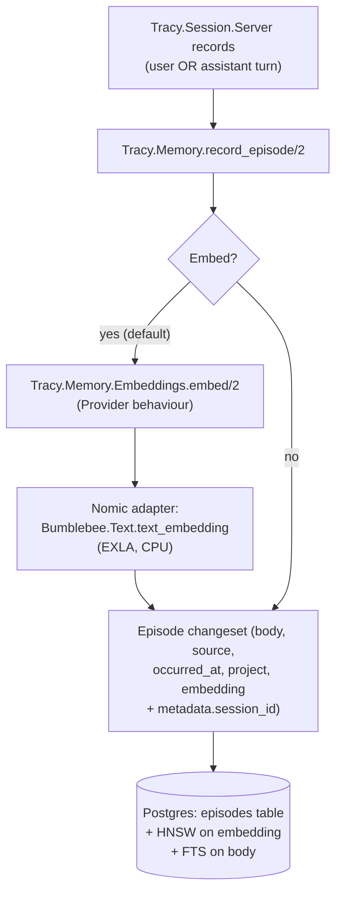
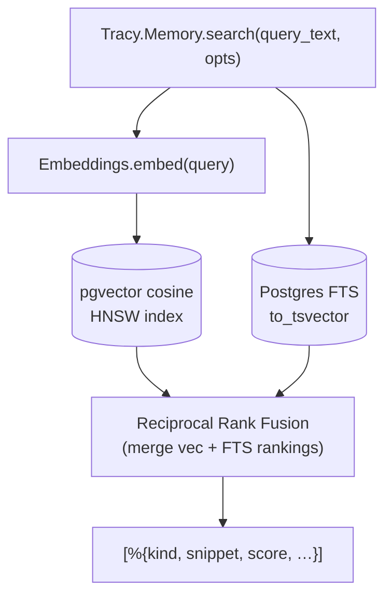
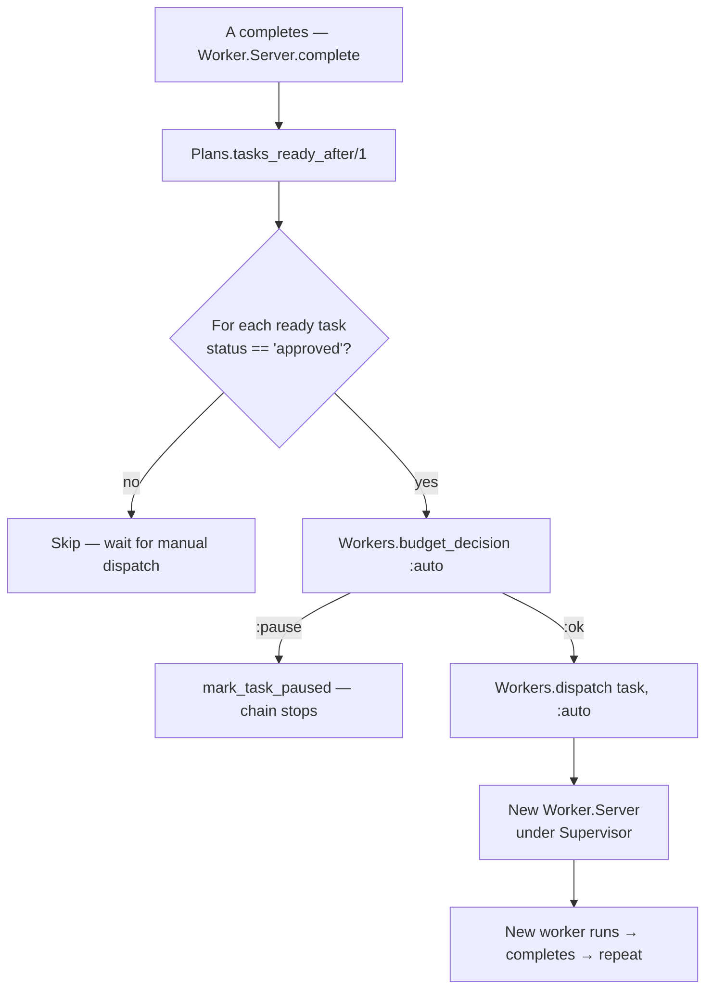
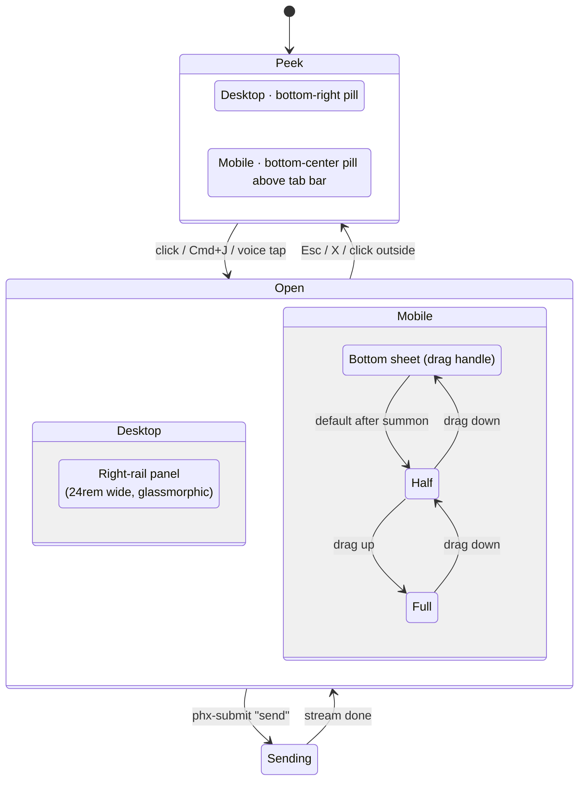
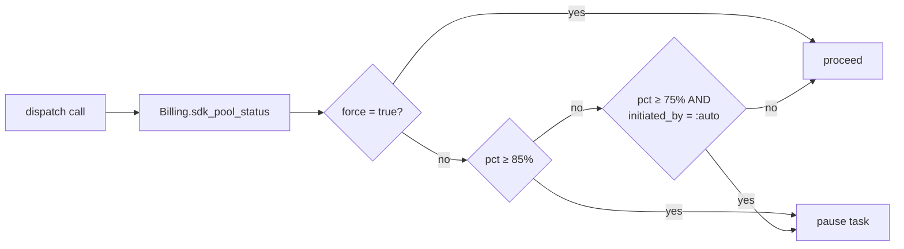

# Tracy — Architecture

**Last updated:** 2026-06-06 (v2 / JARVIS pivot)

This is the source of truth for *how Tracy works as a system*. Read this when you need to find which subsystem owns a behavior, trace a request end-to-end, or understand why something is wired the way it is.

For *what Tracy is* and *why we made the major design calls* read these instead:

- [`TRACY_V2.md`](../TRACY_V2.md) — the JARVIS pivot, persona, what's shipping in v2
- [`/home/matt/Code/TRACY_CSUITE.md`](../../TRACY_CSUITE.md) — original C-Suite frame
- [`/home/matt/Code/TRACY_V1_SCOPE.md`](../../TRACY_V1_SCOPE.md) — budget gate, day-job buffer
- [`/home/matt/Code/TRACY_FUTURE.md`](../../TRACY_FUTURE.md) — deferred ideas with triggers

---

## 1. The system at a glance

Tracy is a single-user **JARVIS-style assistant** running as a Phoenix/Elixir application on Matt's NUC, reached over Tailscale. One persistent chat surface (the **ChatDock**) is always available; it backs onto one **Boardroom Session** (a long-lived GenServer); the session talks to **Claude** via the SDK pool; **Memory** is the second brain (Postgres + pgvector + Apache AGE + local embeddings via Bumblebee + Nomic); **Workers** are specialist Claude instances that Tracy spawns when the work calls for parallelism or backgrounding.



**Key invariants** (don't break these):

1. **One brain, many surfaces.** The boardroom (sessions + LLM) is the single conversational state. Every page (`/projects`, `/memory`, `/plans/*`) is a view onto it or related state. The ChatDock lets Matt talk to that brain from anywhere.
2. **Workers are tools Tracy uses, not Matt's primary interaction.** Matt asks; Tracy decides whether to do the work inline or spawn a worker.
3. **All Claude calls go through `claude -p` (via `claude_agent_sdk`).** Never raw HTTP via `anthropix`. The SDK pool is how the Max plan bills.
4. **All durable state lives in Postgres.** No JSON files in the filesystem masquerading as truth.
5. **Local-first.** Bumblebee + Nomic for embeddings, Tailscale for reach. No cloud lock-in. No paid SaaS in the runtime path beyond Claude itself.
6. **Budget gate is enforced, not advisory.** `Workers.dispatch/2` blocks above 75% (auto) and 85% (everything except `:force`).

---

## 2. Subsystem map

| Subsystem | Lives in | Public API | Role |
|---|---|---|---|
| **Persona** | `lib/tracy/persona.ex` | `Persona.system_prompt/1` | Tracy's voice, baked into every Claude call |
| **Session** | `lib/tracy/session/` | `Session.start/1`, `stream_message/2`, `messages/1` | Per-user boardroom GenServer + streaming |
| **LLM** | `lib/tracy/llm/` | `LLM.chat/2`, `LLM.stream_chat/3` | Behaviour + Stub + Claude SDK adapter |
| **Memory** | `lib/tracy/memory/` | `Memory.record_episode/2`, `current_facts/1`, `search/2` | Episodes / Facts / Procedures + retrieval |
| **Embeddings** | `lib/tracy/memory/embeddings/` | `Embeddings.embed/2`, `embed_many/2` | Stub for tests, Nomic-via-Bumblebee in prod |
| **Plans** | `lib/tracy/plans/` | `Plans.create_plan/1`, `create_task/1`, `transition_task/2`, `approve_task/1`, `tasks_ready_after/1`, `workspace_path/1` | Plans + Tasks + dep graph + workspace dirs |
| **Workers** | `lib/tracy/workers/` | `Workers.dispatch/2`, `Workers.cancel/1`, `Workers.transcript/1`, `Workers.budget_decision/2` | Per-task Claude subprocesses with progress streaming |
| **Billing** | `lib/tracy/billing/` | `Billing.record_run/1`, `Billing.sdk_pool_status/0`, `Billing.gate_sdk_pool/0` | Cost ledger + 75/85% thresholds |
| **Assets** | `lib/tracy/assets/` | `Assets.create_file_asset/1`, `list_asset_summaries/1` | Per-plan binary attachments (Postgres `bytea`) |
| **Web — chat** | `lib/tracy_web/live/chat_dock_live.ex`, `boardroom_live.ex` | LiveView routes | Sticky JARVIS chat + standalone boardroom |
| **Web — oversight** | `lib/tracy_web/live/projects_live.ex`, `memory_live.ex` | LiveView routes | Read-mostly dashboards |
| **Web — drill-down** | `lib/tracy_web/live/plan_live/`, `task_live/` | LiveView routes | Per-plan + per-task detail |

**Behaviour-driven seams.** Three external concerns are abstracted behind Elixir behaviours so dev/test can swap them and prod can scale them independently:

- `Tracy.LLM` — `Stub` (deterministic), `Claude` (real). Switch via `config :tracy, Tracy.LLM, adapter: …`.
- `Tracy.Memory.Embeddings.Provider` — `Stub` (deterministic 768-dim), `Nomic` (Bumblebee). Switch via `config :tracy, Tracy.Memory.Embeddings, provider: …`.
- `Tracy.Workers.Adapter` — `Stub`, `Claude`, `RaisingAdapter` (test). Per-role override via `config :tracy, Tracy.Workers, per_role: %{…}`.

---

## 3. Supervision tree



**Lifecycle policies:**

- **Sessions** — `:transient`. Idle-timeout at 30 minutes; restart only on abnormal exit.
- **Workers** — `:transient`. Run to completion, then `:stop, :normal`. Don't restart on completion.
- **Nomic embedder** — `:permanent`. Stays up; lazy-loads model on first call. One per node.

---

## 4. Conversation flow — Matt types a message

End-to-end from a keystroke in the ChatDock to a streaming reply in the bubble:

```mermaid
sequenceDiagram
  participant B as Browser
  participant Dock as ChatDockLive
  participant Sess as Tracy.Session.Server
  participant LLM as Tracy.LLM (Claude adapter)
  participant Claude as claude -p subprocess
  participant Mem as Tracy.Memory

  B->>Dock: phx-submit "send" {composer: "fix the favicon warnings"}
  Dock->>Dock: not a slash command → dispatch_message/2
  Dock->>Sess: stream_message(session_id, text)
  Sess->>Mem: record_episode(user message)
  Mem-->>Sess: ok
  Sess->>Sess: spawn Task that calls LLM.stream_chat
  Sess->>LLM: stream_chat(messages, opts, callback)
  LLM->>LLM: build options (Persona.system_prompt + tool surface)
  LLM->>Claude: query(prompt, sdk_opts) — Stream
  loop For each SDK message
    Claude-->>LLM: assistant chunk
    LLM->>Sess: callback({:chunk, text})
    Sess-->>Dock: PubSub session:&lt;id&gt; {:chunk, text}
    Dock->>B: stream_insert assistant bubble (live update)
  end
  Claude-->>LLM: result (cost, usage)
  LLM->>LLM: Billing.record_run(cost_micros, …)
  LLM-->>Sess: {:ok, response}
  Sess->>Mem: record_episode(assistant message)
  Sess-->>Dock: PubSub {:done, response}
  Dock->>B: finalize bubble, update cost meter
```

**Why each hop exists:**

- **Episode record on every turn** — feeds the second brain. Background consolidation (Phase 1F) extracts Facts from these.
- **Persona system prompt computed per call** — includes current pool zone (`:winddown` etc) so Tracy adjusts behavior dynamically.
- **Streaming via PubSub** — Session GenServer + LiveView are different processes; Phoenix.PubSub fan-out lets multiple subscribers (the dock AND a standalone `/boardroom` page in another tab) see the same conversation.
- **Cost recorded inside `LLM.chat`** — the only place that knows the real spend. Workers do the same in their own `Tracy.Billing.record_run` call.

---

## 5. Worker dispatch flow — backgrounded work

When Tracy decides (or Matt explicitly asks) to spawn a specialist:



**Key points:**

- **Budget gate is the first thing.** Even a `:user`-initiated dispatch checks. The 75% threshold pauses *auto* (chained) dispatches; 85% pauses both unless `force: true`.
- **Progress transcript lives in the Worker.Server state.** `Workers.transcript/1` exposes it so the Live tab can backfill if Matt arrives mid-execution.
- **Workspace is set as `cwd`.** Per-plan `workspaces/plans/<id>/` directory; survives across dispatches; workers see other workers' artifacts.
- **Spawned tasks inherit approval.** If the completing task was approved (CEO stamp), proposed children land with `status: "approved"` and the parent's `approved_at` timestamp. Chain marches without re-clicking.
- **Two completion notifications.** The per-task PubSub event (`worker:<id>`) goes to the task's Live tab. The global one (`chat:notifications`) drops a system bubble into Matt's chat.

---

## 6. Memory flow — write and read

### Write path (every conversation turn + every consolidated fact)



Facts and Procedures follow the same shape; their schemas have `valid_from` / `valid_to` / `superseded_by_id` for bi-temporal supersession.

### Read path (hybrid pgvector + FTS)



**Why hybrid:** vector alone misses exact-keyword lookups ("favicon", proper nouns, error strings). FTS alone misses semantic neighbors ("the Spider mark" vs "the logo"). RRF combines them deterministically without tuning a magic weight.

**Bi-temporal facts model** (stolen from Graphiti; implemented in `lib/tracy/memory/fact.ex`):

```
fact_v1: "Matt prefers no umbrellas" valid_from=Jun 4   valid_to=Jun 5   superseded_by=fact_v2
fact_v2: "Matt prefers umbrella for tracy"             valid_from=Jun 5  valid_to=NULL  (current)
```

A current fact has `valid_to IS NULL`. Time-travel queries (e.g. "what did Tracy believe last Tuesday?") work by selecting facts where `valid_from <= T AND (valid_to IS NULL OR valid_to > T)`.

---

## 7. Chain dispatch flow — CEO approval + dep graph

Tasks form a DAG via `tasks.blocked_by :: [uuid]`. A task becomes ready when all blockers are `done`. Auto-dispatch fires when the task carries the **approved** status (CEO stamp).



**Failure breaks the chain by design.** Downstream tasks stay `backlog`/`approved` because their blocker isn't `done`. Recovery: manual redispatch of the failed task; if it succeeds, fan-out resumes.

**Spawn inheritance.** When a worker emits a `## Proposed Tasks` block, the inserter checks the parent's `metadata.approved_at`. If set, children inherit the `approved` status + the timestamp, so the CEO stamp propagates.

**`depends-on:` syntax in spawned tasks.** A worker can declare in-block dependencies:

```
## Proposed Tasks
- [engineer] Implement the mockup
  depends-on: this
- [reviewer] Verify it matches the brief
  depends-on: Implement the mockup
```

Resolution: `this` → parent task id; named ref → exact-title match against newly-spawned siblings first, then existing plan tasks.

---

## 8. ChatDock — three shells, one brain



**Hardpoints:**

- The dock LiveView is mounted **sticky** from `root.html.heex` (gated on `assigns[:current_scope] && assigns[:socket]`). Survives every `live_redirect` between authenticated pages — the conversation never remounts.
- Same `Tracy.Session` as the standalone `/boardroom` page (both derive session id from `user.id`). Two views, one room.
- Voice in via the browser `SpeechRecognition` API (Safari + Chrome + Edge). Interim transcripts stream into the composer; final transcript auto-submits.
- Notification subscriptions on mount: `session:<id>` (chunks), `chat:context:<user_id>` (pin updates from pages), `chat:notifications` (worker completions).

---

## 9. Persona — how Tracy sounds

`Tracy.Persona.system_prompt(opts)` is called by `Tracy.LLM.Claude` for every Boardroom call. It returns:

1. **Base persona block** — identity, voice, what-she-does-and-doesn't-do, JARVIS frame
2. **Runtime context block** (when supplied) — pinned project, SDK pool zone, in-flight worker list

The base block is locked down by `Tracy.PersonaTest` — any drift in identity (e.g. accidentally adding "As an AI" or losing the first-person directive) fails CI. Tests verify: name == Tracy, no AI disclaimers, JARVIS frame intact, Conventional Commits + Tracy-Task trailer rules, 75/85% budget gate references.

**Why a module not a config string:** the persona drifts when it's spread across `system_prompt_addendum`, an LLM behaviour comment, and a runtime config blob. One module, one place to edit, callable from anywhere, version-controlled.

---

## 10. Budget gate — load-bearing safety

Single function: `Tracy.Workers.budget_decision(initiated_by, force?)`. Three outcomes:



**Constraint comes from `feedback_day_job_buffer.md`** — Matt's Max 5x plan is shared with his day job. Tracy must implement graceful wind-down at 75% and a hard stop at 85% so his day-job work isn't starved.

**The gate is enforced in code now**, not honor system. A future change that breaks the gate breaks Matt's day-job protection too. The unit test `budget_decision in the 75-85% band` is the regression check.

---

## 11. Per-plan workspace — where workers actually do work

`Tracy.Plans.workspace_path/1` returns an absolute path:

```
$WORKSPACE_ROOT/plans/<plan_id>/
```

Default `WORKSPACE_ROOT = "workspaces"` at the repo root, overridable via `config :tracy, workspace_root: "/abs/path"` for prod.

**The directory is the worker's `cwd`.** They `ls` it on boot, see prior workers' artifacts, organize with `mkdir`, edit in-place, drop new files. It's git-ignored — large binaries don't belong in source control.

**Per-role tool surfaces** (`Tracy.Workers.Claude.role_allowed_tools/1`):

- `engineer` — full default: `Read Grep Glob WebSearch WebFetch Bash Edit Write`
- `designer` — drops `Edit` (writes new artifacts; doesn't modify existing code)
- `researcher`, `reviewer` — read-only: `Read Grep Glob WebSearch WebFetch`
- `note_taker` — read + write only (no Bash)

**Commit discipline** (from `build_prompt/2`): any worker that touches the git-tracked source tree must stage explicit paths, verify with `git diff --cached --stat`, write a Conventional Commits message with `Tracy-Task: <uuid>` trailer, and **not push**.

---

## 12. Where to find things

**By symptom:**

- *"Tracy doesn't sound right"* → `lib/tracy/persona.ex` + `Tracy.LLM.Claude.system_prompt_addendum`
- *"Cost meter is wrong"* → `lib/tracy/billing.ex` (rollup), `Tracy.LLM.Claude.log_run` / `Tracy.Workers.Claude.build_report` (writes)
- *"Worker hangs / didn't fire"* → `Tracy.Workers.dispatch` budget gate → `Workers.Server.handle_info(:run)` mark_in_progress → `spawn_adapter`
- *"Chain didn't auto-fire"* → check `tasks.status` of the next link — must be `"approved"` for fan-out, not just `"backlog"`. `Workers.Server.fan_out_auto_dispatches` filters explicitly.
- *"Memory doesn't recall X"* → `Tracy.Memory.search/2` is RRF over pgvector + FTS. Try `current_facts/1` to see what's actually stored.
- *"Chat dock isn't showing up"* → only renders when `current_scope && socket` are in root layout assigns. `live` routes have both; controller routes don't.
- *"Live transcript doesn't update"* → `Workers.Server` broadcasts on `worker:<task_id>` topic; TaskLive subscribes on mount. Check `phx-update="stream"` + dom_id collision.

**By module name:**

- `Tracy.Persona` — voice
- `Tracy.Session` / `Session.Server` — boardroom GenServer
- `Tracy.LLM` / `Tracy.LLM.Claude` — call out to claude -p
- `Tracy.Memory` / `Memory.Embeddings.Nomic` — second brain + local embedder
- `Tracy.Plans` / `Plans.Task` — work definitions + chain wiring
- `Tracy.Workers` / `Workers.Server` / `Workers.Claude` — backgrounded specialists
- `Tracy.Billing` / `Billing.AgentRun` — cost ledger
- `TracyWeb.ChatDockLive` — JARVIS chat surface
- `TracyWeb.ProjectsLive` / `MemoryLive` — read-mostly dashboards
- `TracyWeb.PlanLive.*` / `TaskLive.Show` — drill-down

---

## 13. What isn't here yet (intentional)

- **No multi-LLM provider abstraction.** Tracy is Claude-only. Keep `Tracy.LLM` thin enough that a future local-models impl is one file; don't preemptively build the abstraction.
- **No autonomous worker scheduler.** Workers fire on dispatch. No cron, no "Tracy decides to run X overnight on her own" yet.
- **No outbound integrations.** No Slack, no Linear, no GitHub webhooks. All of those are in `TRACY_FUTURE.md` with trigger conditions.
- **No worktree-per-task isolation.** Workers share the per-plan workspace; parallel engineers on the same files would race. Worktree isolation is Phase 3 when concurrency demands it.
- **No daily reflection job.** The Memify-style consolidator is documented but not yet scheduled. Listed in `TRACY_V2.md` §"Memory architecture" as next.

---

*This doc is the source of truth for system shape. When you change architecture, update this — the diagrams are what future-you actually reads.*
