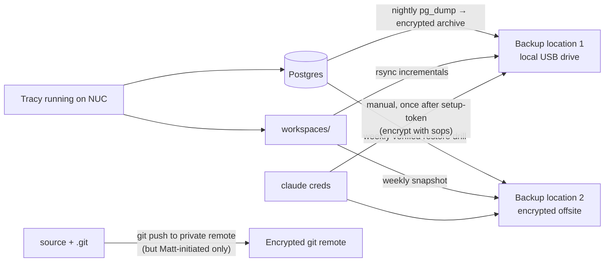

# Tracy — Operations

**Last updated:** 2026-06-06 (v2)

How to back Tracy up, restore her, move her to a new machine. What's durable, what's transient, what's local-only. The disaster-recovery / portability guide.

---

## 1. What Tracy actually IS, materially

When you "move Tracy," you're moving these things, in priority order:

| Tier | What | Where on disk | Size | Replaceable? |
|---|---|---|---|---|
| **1 — Irreplaceable** | Postgres data (Episodes, Facts, Procedures, Plans, Tasks, AgentRuns, Users) | Postgres data dir | MB → GB over time | NO. This is Tracy's memory. |
| **1 — Irreplaceable** | Per-plan workspaces (designer SVGs, generated PNGs, brand assets, scratch files) | `<repo>/workspaces/plans/<id>/` | Variable (MB → GB depending on what workers produce) | NO. Worker output. |
| **2 — Hard to recreate** | Claude OAuth credentials (Max plan auth) | `~/.claude/.credentials.json` | <1KB | YES via `claude setup-token` on new machine, but takes a manual login flow. |
| **2 — Hard to recreate** | Source code + git history | `<repo>/.git/` | tens of MB | YES from any clone/backup, but local commits unpushed are vulnerable. |
| **3 — Recreatable** | Nomic embedding model cache | `~/.cache/bumblebee/` | ~250MB | YES — auto-downloads on first embed call (~5-30s). |
| **3 — Recreatable** | EXLA / XLA precompiled binary | `~/.cache/xla/` | ~200MB | YES — auto-builds on `mix compile`. |
| **3 — Recreatable** | Hex deps cache | `<repo>/deps/`, `~/.mix/` | hundreds of MB | YES — `mix deps.get` rebuilds. |
| **4 — Machine-bound** | Tailscale device identity | OS-managed | n/a | NO — new machine gets new tailscale node. Hostname changes. |
| **4 — Machine-bound** | Local sops/age key | `~/.config/sops/age/keys.txt` | <1KB | NO if lost — re-encrypt secrets with the new key. |

**Translation:** Tier 1 is the ENTIRE point of moving Tracy. Tier 2 is the auth + code substrate. Tiers 3-4 you re-bootstrap on the target.

---

## 2. Backup strategy

### 2.1 What to back up, how often



### 2.2 Concrete backup commands

**Nightly Postgres dump** (cron, or systemd timer). Encrypt with `age`, keep 14 daily + 12 weekly + 6 monthly:

```bash
# /usr/local/bin/tracy-backup-postgres.sh
set -euo pipefail
TS=$(date -u +%Y%m%dT%H%M%SZ)
DEST=/srv/tracy-backups
mkdir -p "$DEST/postgres"

# Dump tracy_dev. -Fc = custom format (compressed, restorable with pg_restore).
pg_dump --format=custom --no-owner --no-acl --dbname=tracy_dev \
  | age -r $(cat ~/.config/age/recipient.txt) \
  > "$DEST/postgres/tracy_dev_${TS}.dump.age"

# Prune daily older than 14d, keep weekly Sunday + monthly 1st
find "$DEST/postgres" -name 'tracy_dev_*.dump.age' -mtime +14 \
  ! \( -name 'tracy_dev_*-W0.dump.age' -o -name 'tracy_dev_*-M.dump.age' \) \
  -delete
```

**Workspace rsync** (separate cron; workspaces are append-mostly so incrementals are cheap):

```bash
# /usr/local/bin/tracy-backup-workspaces.sh
set -euo pipefail
rsync -a --delete /home/matt/Code/tracy/workspaces/ /srv/tracy-backups/workspaces/

# Then for offsite, tar + encrypt + send
tar -cf - -C /srv/tracy-backups workspaces \
  | age -r $(cat ~/.config/age/recipient.txt) \
  > "/srv/tracy-backups/workspaces_$(date -u +%Y%m%d).tar.age"
```

**Code: trust git.** Matt commits locally; he can push to a private encrypted remote when he wants offsite. v2 is on branch `v2`; `main` lives wherever you set it. No automation here — Matt handles git pushes himself per `feedback_no_agent_push.md`.

**Claude credentials: manual.** Right after `claude setup-token`, encrypt `~/.claude/.credentials.json` with sops/age and stash a copy on the offsite drive. Re-create only if lost — `claude setup-token` will overwrite, but the token rotation means old encrypted backups become stale.

### 2.3 What NOT to back up (waste of bytes)

- `~/.cache/bumblebee/` — auto-downloads.
- `~/.cache/xla/` — auto-builds.
- `<repo>/deps/`, `<repo>/_build/` — `mix deps.get && mix compile` rebuilds.
- `<repo>/priv/static/assets/` — esbuild + tailwind rebuilds.
- `<repo>/node_modules/` (if any get added later) — npm install rebuilds.

---

## 3. Restoring on a fresh machine

The disaster-recovery / migration drill. Goal: `git clone` → working Tracy with memory intact, in <30 min on decent hardware.

### 3.1 Prerequisites on the target machine

```bash
# Arch / Manjaro — adjust for your distro
sudo pacman -S \
  postgresql postgresql-libs \
  erlang elixir \
  git curl tar \
  age age-keygen \
  imagemagick librsvg \
  build-essential clang gcc

# Optional but recommended (TOOLS_TODO.md is the full list)
sudo pacman -S ffmpeg pandoc tesseract tesseract-data-eng
paru -S watchman-bin  # AUR — speeds up Phoenix's file watcher
```

If using asdf / kerl / kiex instead of system packages, install elixir 1.19+ and Erlang/OTP 28 via the version manager you prefer.

### 3.2 Postgres setup

```bash
sudo systemctl enable --now postgresql
sudo -u postgres createuser -d -s postgres   # if not already
sudo -u postgres psql -c "ALTER USER postgres WITH PASSWORD 'postgres';"

# Install extensions Tracy needs
sudo -u postgres psql -c "CREATE EXTENSION IF NOT EXISTS vector;"
sudo -u postgres psql -c "CREATE EXTENSION IF NOT EXISTS age;"
# AGE wants LOAD per-query; nothing else system-level here.
```

You'll need `pgvector` + `apache-age` packaged for your distro. On Arch: `pgvector` via AUR or build-from-source; AGE same. If they're already on the source machine, just snapshot a working `paru -Q` list and replay it.

### 3.3 Drop the backed-up data in

```bash
# Restore the latest tracy_dev dump
age -d -i ~/.config/age/key.txt \
  < /srv/tracy-backups/postgres/tracy_dev_LATEST.dump.age \
  | pg_restore --create --clean --no-owner --no-acl --dbname=postgres

# Restore workspaces — preserves the directory layout the workers expect
mkdir -p /home/matt/Code/tracy/workspaces
age -d -i ~/.config/age/key.txt \
  < /srv/tracy-backups/workspaces_LATEST.tar.age \
  | tar -xf - -C /home/matt/Code/tracy/
```

### 3.4 Source code + Claude auth

```bash
git clone <your remote> /home/matt/Code/tracy
cd /home/matt/Code/tracy
git checkout v2  # or whatever branch is current

# Restore Claude OAuth — either from backup or re-do interactively
mkdir -p ~/.claude
age -d -i ~/.config/age/key.txt \
  < /srv/tracy-backups/claude_credentials.json.age \
  > ~/.claude/.credentials.json
# OR fresh:
# claude setup-token  # browser flow, ~30 seconds

# Build the app
mix deps.get
mix compile
mix ecto.migrate  # idempotent — should be no-op against the restored DB
```

### 3.5 Boot + verify

```bash
mix phx.server &
PHX_PID=$!

# Smoke checks
sleep 3
curl -sf http://localhost:4000/users/log-in > /dev/null && echo "✓ login page serves" || echo "✗ login fails"
psql -h localhost -U postgres -d tracy_dev -c "SELECT count(*) FROM episodes;" \
  && echo "✓ episodes table intact"

# Test the embedder lazily (first call downloads model)
echo "Warming Nomic embedder..."
iex --eval '
  {:ok, vec} = Tracy.Memory.Embeddings.embed("smoke test")
  IO.puts("✓ embedder produced #{length(vec)}-dim vector")
'

# Done — log in, check the chat dock, verify a recent fact is queryable
echo "Restore complete. Open http://localhost:4000 and verify."
kill $PHX_PID
```

If the embedder takes 30s on the first call, that's the model downloading. Normal. Future calls will be warm.

### 3.6 Network identity (Tailscale)

The new machine needs to join the tailnet:

```bash
sudo tailscale up --hostname arch  # or whatever you want it called
```

This generates a new node identity. From other devices (phone, laptop), the IP/hostname will be different unless you reuse the exact tailnet name. Update bookmarks and any `arch:4000` references on your phone.

Tracy itself doesn't care about Tailscale identity — she binds `0.0.0.0:4000` and is reachable from whatever Tailscale shows the device as.

---

## 4. What's machine-bound (won't move automatically)

These need conscious handling at migration:

| Item | Why bound | Fix |
|---|---|---|
| Tailscale device identity | Each install gets a new node | `tailscale up` on new machine; update IP bookmarks |
| Sops/age key | Encrypts secrets | Copy `~/.config/age/keys.txt` to new machine (do this OFFLINE on USB) |
| Claude OAuth token | Bound to the Anthropic account, but the on-disk file is plain | Copy file OR re-run `claude setup-token` |
| Cron / systemd timers | Distro-specific | Re-install via shell script kept in `<repo>/ops/` (TODO if Matt wants to formalize) |
| ssh keys | Per-machine | Generate new, add public key to git remotes |
| Phoenix `secret_key_base` | Config baked at compile time | Regenerate with `mix phx.gen.secret`; sessions invalidate (Matt re-logs in once) |

The age key is the load-bearing one — if you lose it, your encrypted backups are unreadable. Keep an offline copy (USB drive in a drawer, or paper printout of the key). Tracy's whole memory store could be the most expensive thing you've ever generated by 2027; an unreadable backup is worse than no backup.

---

## 5. Running operational concerns

### 5.1 Disk space

- **Postgres** grows linearly with conversation volume. Episodes are ~1KB each + a 768-dim vector. At 100 conversations/day that's ~4-8MB/day raw, less after pgvector + HNSW overhead. Tens of GB over years; not panic-worthy on modern disks.
- **Workspaces** grow with worker output. Designer SVGs are tiny; PNG renders cost more. Periodic pruning of old plan workspaces (or moving them to cold storage) is reasonable when a project finishes.
- **Backups** grow per the retention policy in §2.2. 14 daily + 12 weekly + 6 monthly = 32 dumps. At ~50MB compressed each that's ~1.5GB of backups; tiny.

Monitor: `df -h /var/lib/postgres` and `du -sh workspaces backups`.

### 5.2 Postgres maintenance

The HNSW indexes on the `embedding` columns get bloated as facts/episodes accumulate. `REINDEX` periodically — quarterly is fine for single-user volume:

```bash
psql -d tracy_dev <<'SQL'
REINDEX INDEX episodes_embedding_hnsw_idx;
REINDEX INDEX facts_embedding_hnsw_idx;
REINDEX INDEX procedures_embedding_hnsw_idx;
VACUUM ANALYZE episodes;
VACUUM ANALYZE facts;
VACUUM ANALYZE procedures;
SQL
```

PostgreSQL handles autovacuum routinely. Manual reindex is a "if search feels slow" tool, not a regular need.

### 5.3 Model + embedder upgrades

When you want to swap embedders (Nomic → Snowflake Arctic, say):

1. Add a new migration that changes the `embedding` column dim to the new model's output size.
2. The migration's `up` should NULL out all existing embeddings (they're now incompatible).
3. Implement the new `Tracy.Memory.Embeddings.Provider` adapter.
4. Flip the config: `config :tracy, Tracy.Memory.Embeddings, provider: NewAdapter`.
5. Run a backfill task that calls `Embeddings.embed/2` on every row with `embedding IS NULL`. Expect this to take hours at scale — schedule overnight.

Pgvector requires the column type's dim to match the inserted vector exactly. There's no "auto-truncate" or "auto-pad."

### 5.4 Budget meter sanity

The SDK pool meter (`Tracy.Billing.sdk_pool_status/0`) sums `agent_runs.cost_micros` for the current month. If your meter ever feels wrong:

```sql
SELECT date_trunc('day', started_at) AS day,
       SUM(cost_micros)::float / 1000000 AS spent_dollars
FROM agent_runs
WHERE bucket = 'sdk_pool'
  AND started_at >= date_trunc('month', NOW())
GROUP BY 1 ORDER BY 1 DESC;
```

vs. what `claude /usage` shows on the official side. These should track. Drift is a bug; investigate before doing anything fancy.

### 5.5 Workers leak detection

Worker.Servers should `:stop, :normal` after completing. If `Tracy.Workers.Supervisor` keeps accumulating children that never terminate, something's wrong:

```elixir
# In iex:
Tracy.Workers.Supervisor |> DynamicSupervisor.count_children()
# %{active: N, ...}  — N should be 0 most of the time
```

Tracy.Workers.cancel/1 brutal-kills via DynamicSupervisor; if you're seeing zombies after cancel, the issue is upstream of v2's wiring.

---

## 6. Periodic ops checklist

Quarterly:
- [ ] Run a restore drill — pick last week's backup, restore to a scratch Postgres on the same machine, verify a known fact is queryable. Confirms the encryption pipeline isn't silently broken.
- [ ] `REINDEX` the HNSW indexes (§5.2).
- [ ] `VACUUM ANALYZE` everything.
- [ ] Check disk space + grow backup retention if needed.
- [ ] Verify age key is still readable from the offline backup location.

Monthly:
- [ ] Look at the cost meter trend. Are workers spending more than expected?
- [ ] Skim `Tracy.Workers.Supervisor.count_children/1` — should usually be 0.
- [ ] Postgres backup retention pruning happens automatically per §2.2; verify the count.

Daily:
- Backups run automatically via cron / systemd timer.
- Tracy keeps running.

---

## 7. Adversarial questions to answer for yourself

1. **The NUC burns down tonight. How long until Tracy is back on a different box?**
   With backups in place: ~30 min (install prerequisites + restore Postgres dump + clone repo + boot). Without backups: hours-to-days, and you've lost everything.

2. **You can only save one thing.**
   The Postgres dump. Everything else is replaceable.

3. **Your age key is on the burning NUC and the offline drawer.**
   Backups are unreadable. Conventional disaster planning: keep age key in three places (NUC, USB, paper). Practice typing the paper key once a year to make sure handwriting hasn't degraded.

4. **Someone replaces the NUC's disk silently with an empty one.**
   Boot-time integrity check would catch this. Tracy doesn't have one. Acceptable risk for single-user; reconsider if the threat model changes.

5. **You're vacationing without your laptop and need Tracy.**
   Tailscale works on the iPhone Tracy is already used from. Browser-based access to `http://arch:4000` works anywhere on the tailnet. You can't run her FROM a phone (the BEAM doesn't fit), but you can drive her.

---

*Update this doc whenever you change backup procedures, schema, or boot-time setup.*
